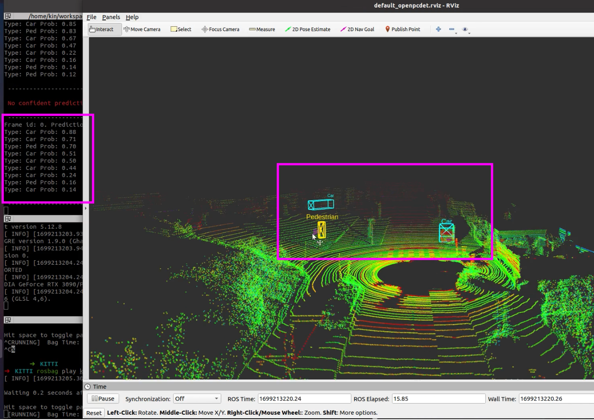
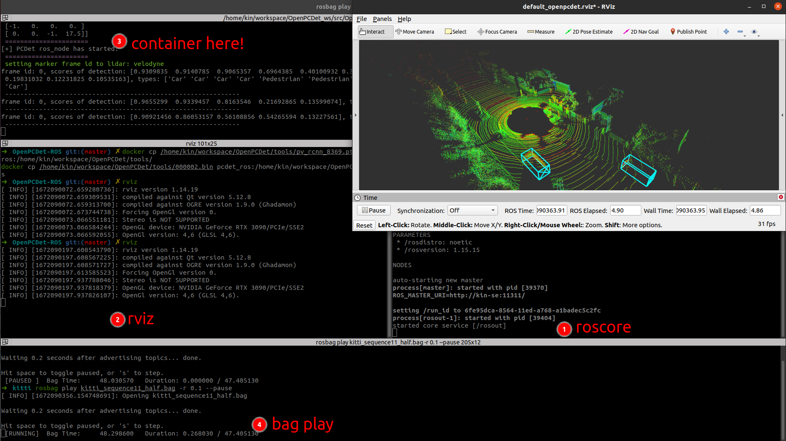

OpenPCDet ROS Running and Visualization
---

Effect pictures:





Test computer and System:

- Desktop setting: i9-12900KF, GPU 3090, CUDA 11.3
- System setting: Ubuntu 20.04, ROS noetic (Python 3.8)
- Test Date: 2022/12/23
- OpenPCDet Version: [fork in Kin-Zhang/OpenPCDet](https://github.com/Kin-Zhang/OpenPCDet), commit: [977cd1c](https://github.com/Kin-Zhang/OpenPCDet/commit/977cd1c19df2a357765f9f013b9c9fd46d907f88)

If you don't want to destroy your env/change your system version, please directly <a href="#Docker">check the docker and build dockerfile</a>. But you still have to have a computer with NVIDIA-GPU and can install cuda. Check [Chinese blog Ubuntu下的NVIDIA显卡【驱动&CUDA 安装与卸载】](https://www.cnblogs.com/kin-zhang/p/17007246.html) 

## Build & RUN

Dependencies:

```bash
sudo apt install ros-noetic-ros-numpy ros-noetic-vision-msgs
pip install pyquaternion
```

And install the [OpenPCDet](https://github.com/open-mmlab/OpenPCDet) in the env
```bash
pip install torch==1.10.0+cu113 torchvision==0.11.0+cu113 torchaudio==0.10.0 -f https://download.pytorch.org/whl/torch_stable.html
pip install spconv-cu113
sudo apt-get install python-setuptools

pip install pyquaternion install numpy==1.23 pillow==8.4
# have some potential risks
sudo chown -R $USER /usr/local/lib/python3.8/
sudo chown -R $USER /usr/local/bin/
# have some potential risks

git clone https://github.com/Kin-Zhang/OpenPCDet
cd OpenPCDet && python3 setup.py develop
```

Run:
```bash
mkdir -p ~/workspace/OpenPCDet_ws/src
cd ~/workspace/OpenPCDet_ws/src
git clone https://github.com/Kin-Zhang/OpenPCDet_ros.git
cd .. && catkin build
source devel/setup.zsh
roslaunch openpcdet 3d_object_detector.launch
```


Demo:

https://user-images.githubusercontent.com/35365764/209409291-8bbfe198-d6c7-4513-96d4-d0d1cc08f3dd.mp4

### Option: Docker<a id="Docker"> </a>

<details>
  <summary>expand to see the docker usage</summary>
Dependencies, install docker and nvidia-container-toolkit, see [some issues](https://github.com/NVIDIA/nvidia-docker/issues/1238)

```bash
distribution=$(. /etc/os-release;echo $ID$VERSION_ID)
curl -s -L https://nvidia.github.io/nvidia-docker/gpgkey | sudo apt-key add -
curl -s -L https://nvidia.github.io/nvidia-docker/$distribution/nvidia-docker.list | sudo tee /etc/apt/sources.list.d/nvidia-docker.list

sudo apt-get update && sudo apt-get install -y nvidia-container-toolkit
sudo systemctl restart docker
```

Build or pull

```bash
# choose one!
# option A: pull
docker pull zhangkin/openpcdet:ros
# option B: build by yourself
git clone https://github.com/Kin-Zhang/OpenPCDet_ros.git && cd OpenPCDet_ros
docker build -t zhangkin/openpcdet:ros .
```

run image to container

```bash
# if you want to display open3d, check the reference for more info
xhost +local:docker
docker run -it --net=host --gpus all -e DISPLAY -v /tmp/.X11-unix:/tmp/.X11-unix --name pcdet_ros zhangkin/openpcdet:ros /bin/zsh

# if not, simple one
docker run -it --net=host --gpus all --name pcdet_ros zhangkin/openpcdet:ros /bin/zsh
```

Because it need detect your setups, also you have to run the `setup.py` inside the container

```bash
cd OpenPCDet && python3 setup.py develop
# After screen print: Finished processing dependencies for pcdet==0.6.0

# Test step cp model and test pcd to container:
docker cp /home/kin/workspace/OpenPCDet/tools/pv_rcnn_8369.pth pcdet_ros:/home/kin/workspace/OpenPCDet/tools/
docker cp /home/kin/workspace/OpenPCDet/tools/000002.bin pcdet_ros:/home/kin/workspace/OpenPCDet/tools

# test demo
cd tools && python3 demo.py --cfg_file cfgs/kitti_models/pv_rcnn.yaml \
    --ckpt pv_rcnn_8369.pth \
    --data_path 000002.bin
```

NOW is ROS TIME, inside container:

```bash
cd /home/kin/workspace/OpenPCDet_ws
catkin build && source devel/setup.zsh
roslaunch openpcdet 3d_object_detector.launch
```


</details>


## Issue/TODO

- [x] finished `Dockerfile`

- [ ] 已知的hard code 有个move_lidar_center的变量 不知道为啥之前的人设置为20，但是实际上openpcdet里无 建议TODO 看一下！ 把hardcode都写到config里！
- [ ] 如果能直接标记点云可能会更好？


## Other infos

This repo has a Chinese blog also to read through [【点云检测】OpenPCDet 教程系列 [1] 安装 与 ROS运行](https://www.cnblogs.com/kin-zhang/p/17002980.html)

### Acknowledgement

All methods and models are from: [open-mmlab/OpenPCDet](https://github.com/open-mmlab/OpenPCDet)

Reference codes:

1. The first version of openpcdet-ros is from: [Cram3r95/OpenPCDet-ROS](https://github.com/Cram3r95/OpenPCDet-ROS)

2. For 3d box marker drawing: [Youtube AI葵](https://www.youtube.com/watch?v=nIiqo3ZuFCc&list=PLDV2CyUo4q-L4YlXUWDytZPz9a8cAWXST&index=11&ab_channel=AI%E8%91%B5) and [his code](https://github.com/kwea123/ROS_notes)

3. open3d in docker vis: [open3d docs](http://www.open3d.org/docs/release/docker.html)

✨✨Stargazers, positive feedback

---

[](https://github.com/Kin-Zhang/OpenPCDet_ros/stargazers)